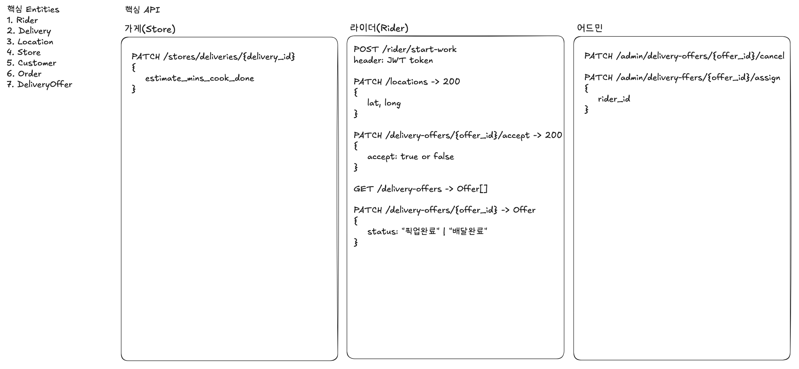

# b-rider
배민 라이더 배차 서비스 구현
본 프로젝트는 배달의 민족과 같은 배달앱에 주문과 라이더를 매칭하는 배차 시스템입니다.

**마이크로서비스 아키텍처(MSA)**를 기반으로 서비스 간 결합도를 낮추고, **Redis Geohashing**을 활용한 실시간 위치 추적 및 **분산 락(Distributed Lock)**을 통한 배차 정합성 보장을 핵심 기술 챌린지로 삼았습니다.

* **핵심 기술 스택:** Nest.js (Backend), Redis (Geospatial & Locking), PostgreSQL, AWS API Gateway.  
* **개발 목표:**  
* 초당 수십만 건의 라이더 위치 업데이트 트래픽 처리.  
* 중복 배차 방지 및 동시성 제어.
* 어드민 수동 배차 조정 기능 구현
* 매칭 알고리즘의 구체 기준/가중치(거리, 가용성, 선호, 평점 등)는 “정교한 알고리즘(추상화)”로 처리, MVP에서는 룰 기반 스코어링으로 시작하는 식의 정의가 필요

## 1. 요구사항

### 기능적 요구사항
- 라이더는 출근 버튼을 눌러서 자동 배차를 받을 수 있다. 이는 10초 내 수락/거절을 할 수 있다.
- 라이더는 자동배차를 수락하고 픽업전 취소 요청 할 수 있다.
- 어드민은 수동으로 특정 배차를 취소 할 수 있다.
- 어드민은 특정 배차를 특정 라이더에게 할당 할 수 있다.
- 라이더 위치를 볼 수 있다.
### 비기능적 요구사항
- 특정 주문은 한명의 라이더에게 매칭 되도록 일관성을 고려한다.
- 매칭을 제외한 기능들은 가용성을 우선으로 개발한다.
- 피크 시간대 튀는 트래픽을 수용할 수 있도록 스케일링을 적용한다.

## 2. 핵심 Entities
- Rider
  - id
  - name
  - status: "배달중" | "오프라인" | "대기중" ...
  - metadata...

- Delivery
  - id
  - store_id
  - pickup_lat
  - pickup_long
  - dest_lat
  - dest_long
  - ETA
  - status: "대기" | "완료" | "배달중" | "매칭중"
  - created_at
- Location
  - lat
  - long
- Store
  - id
  - name
  - lat
  - long
  - metadata...
- DeliveryOffer
  - id
  - rider_id
  - delivery_id
  - status: "응답대기" | "거절" | "승락"
  - offered_at
  - reject_at
  - 
  

- Customer
  - id
  - name
  - metadata...
- Orders
  - id
  - customer_id
  - weight
  - etc...

## 3. 핵심 API

## 4. High 레벨 디자인

## 5. low 레벨 디자인
### location DB 선택
| **비교 항목** | **1. RDBMS (Naive)**                           | **2. PostGIS (Spatial DB)**                     | **3. Redis (In-Memory)**                           |
| --------- | ---------------------------------------------- | ----------------------------------------------- | -------------------------------------------------- |
| **기술 스택** | PostgreSQL + B-Tree                            | PostgreSQL + GIST(R-Tree)                       | **Redis + Geohash**                                |
| **작동 원리** | `lat`, `lon` 컬럼에 각각 인덱스 생성 후 범위 검색 (`BETWEEN`) | 공간 데이터를 위한 특수 자료구조(R-Tree) 사용하여 2차원 검색 최적화      | 위도/경도를 문자열(Geohash)로 변환하여 **ZSET(Sorted Set)**에 저장 |
| **장점**    | 구현이 매우 단순함. 별도 확장이 필요 없음.                      | 복잡한 지리 연산(다각형 포함 여부 등)에 최적화됨. 데이터 영속성 보장.       | **압도적인 쓰기/읽기 속도.** 구현이 간편하며 TTL 설정 용이.             |
| **단점**    | **성능 최악.** 두 인덱스의 교집합(Intersection) 연산 비용이 큼.  | **업데이트 비용이 매우 비쌈.** 잦은 위치 변경 시 인덱스 재구성 오버헤드 발생. | 메모리 비용 발생. 서버 다운 시 일부 데이터 휘발 가능성 (AOF로 보완).        |

## MVP 외 추가 기능

### 시스템 회복 탄력성, 서킷 브레이커(Circuit Breaker) 및 데드 레터 큐(DLQ)를 활용한 장애 격리.

### 지역 기반 인스턴스 복제 배포

### 알뜰 배달
* 한집 배달, 알뜰 배달(구간 배달) 구분 구현
* 자동 알뜰 배달 묶음 기능
* 가게 조리 완료 시간 고려
* 라이더는 배차들 목록 중에서 선택해서 일반 배차 기능을 사용 할 수 있다.

### Kafka

### 수평 확장 전략
* **Stateless Architecture:** 각 서비스들은 상태를 로컬 메모리에 저장하지 않고 Redis와 DB로 위임하여, 트래픽 급증 시 즉각적인 오토 스케일링이 가능하도록 설계
* **Event-Driven Communication:** 서비스 간 통신은 Kafka를 통해 비동기로 처리하여, 주문 폭주 시에도 시스템 전체가 셧다운되지 않고 큐(Queue)에 쌓아두어 처리량을 조절
