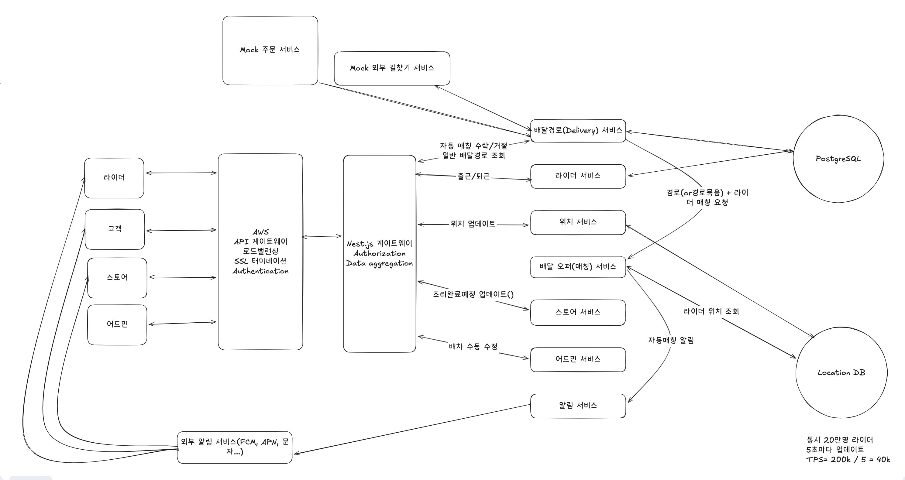

# b-rider
배민 라이더 배차 서비스 구현
본 프로젝트는 **배달의 민족**과 유사한 환경에서 피크타임(점심/저녁, 우천 시, 스포츠 경기 등)에 발생하는 대규모 배달 요청을 안정적으로 처리하고, 배달원(Rider)과 주문(Order)을 최적의 상태로 매칭하는 **지능형 배차 시스템**입니다.

단순한 CRUD가 아닌, **마이크로서비스 아키텍처(MSA)**를 기반으로 서비스 간 결합도를 낮추고, **Redis Geohashing**을 활용한 실시간 위치 추적 및 **분산 락(Distributed Lock)**을 통한 배차 정합성 보장을 핵심 기술 챌린지로 삼았습니다.

* **핵심 기술 스택:** Nest.js (Backend), Redis (Geospatial & Locking), Kafka (Message Queue), PostgreSQL, AWS API Gateway.  
* **개발 목표:**  
* 초당 수십만 건의 라이더 위치 업데이트 트래픽 처리.  
* 중복 배차 방지 및 동시성 제어.
* 한집 배달, 알뜰 배달(구간 배달) 구분 구현
* 자동 알뜰 배달 묶음 기능
* 가게 조리 완료 시간 고려
* 어드민 수동 배차 조정 기능 구현
* 매칭 알고리즘의 구체 기준/가중치(거리, 가용성, 선호, 평점 등)는 “정교한 알고리즘(추상화)”로 처리, MVP에서는 룰 기반 스코어링으로 시작하는 식의 정의가 필요

## 1. 요구사항

### 기능적 요구사항
- 라이더는 출근 버튼을 눌러서 자동 배차를 받을 수 있다. 이는 수락(30초)/거절을 할 수 있다.
- 라이더는 자동배차를 수락하고 도중에 취소 요청 할 수 있다.
- 라이더는 배차들 목록 중에서 선택해서 일반 배차 기능을 사용 할 수 있다.
- 어드민은 수동으로 특정 배차를 취소 할 수 있다.
- 어드민은 특정 배차를 특정 라이더에게 할당 할 수 있다.
- 라이더 위치를 볼 수 있다.
- 자동 배차를 기본으로 하되, 매칭 실패 건에 한해 일반 배차로 넘어간다.
### 비기능적 요구사항
- 특정 주문은 한명의 라이더에게 매칭 되도록 일관성을 고려한다.
- 매칭을 제외한 기능들은 가용성을 우선으로 개발한다.
- 피크 시간대 튀는 트래픽을 수용할 수 있도록 스케일링을 적용한다.
- 동일 주문에 대해 다수의 라이더가 동시에 수락 요청을 보내도 단 1명만 성공해야 한다.

## 2. 핵심 Entities
1. Rider
2. Delivery
3. Location
4. Store
5. Customer
6. Orders
7. DeliveryOffer

## 3. 핵심 API

## 4. High 레벨 디자인

## MVP 외 추가 기능

### 시스템 회복 탄력성, 서킷 브레이커(Circuit Breaker) 및 데드 레터 큐(DLQ)를 활용한 장애 격리.

### 지역 기반 데이터베이스 샤딩 진행

### 수평 확장 전략
* **Stateless Architecture:** 각 서비스들은 상태를 로컬 메모리에 저장하지 않고 Redis와 DB로 위임하여, 트래픽 급증 시 즉각적인 오토 스케일링이 가능하도록 설계
* **Event-Driven Communication:** 서비스 간 통신은 Kafka를 통해 비동기로 처리하여, 주문 폭주 시에도 시스템 전체가 셧다운되지 않고 큐(Queue)에 쌓아두어 처리량을 조절
